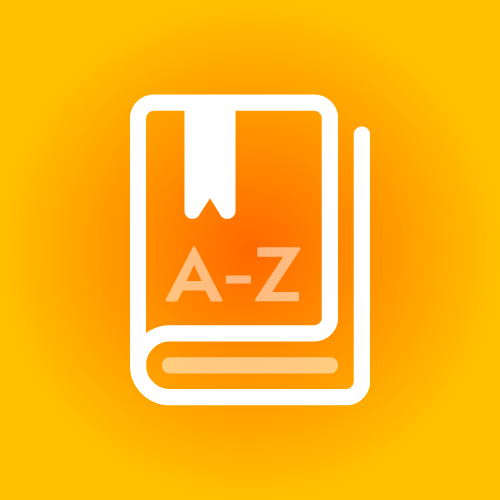

## Glossary App for DNN / 2sxc
This is a basic term glossary with

1. All terms are sorted by alphabet and grouped by initial letter
1. A-Z link-bar
1. Details page for each term with SEO url containing the term and whatever else you want
1. Multi-language
1. versioned data
1. etc.

See screenshots and read more about it in the [app-catalog](http://2sxc.org/en/Apps/glossary-a-z)